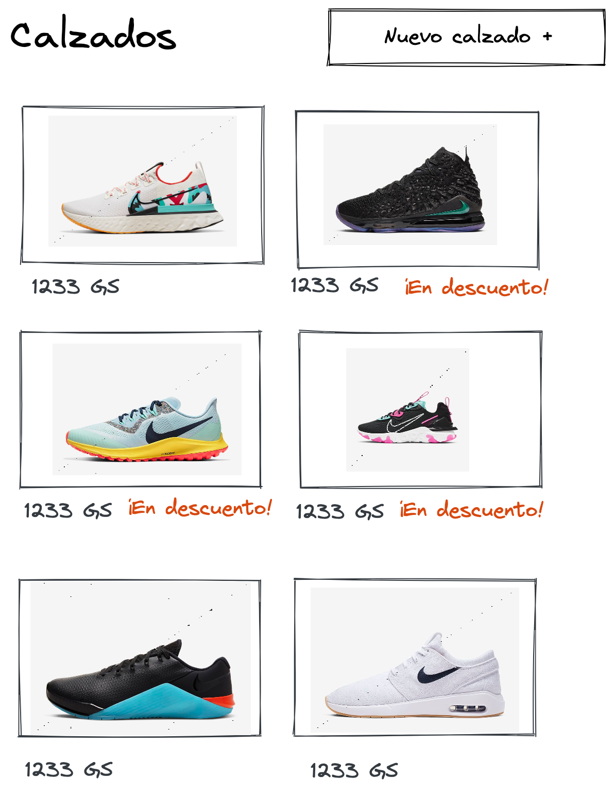
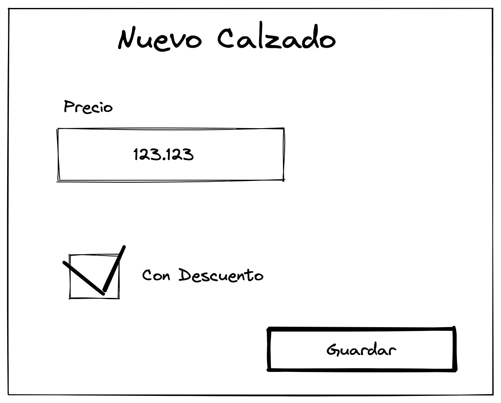

# Ecommerce con JSP y Spring Boot

Ejercicio de construcción de una página de calzados.

## Descripción de tarea

### Ejercicio 1
Implementar una página JSP que liste desde el backend un conjunto de calzados junto a la información de cada calzado:
- Precio
- Si está en descuento o no
- Una imágen del calzado




Se pueden modelar los calzados usando estructuras de datos de Java

🍸 `Desafío bono`:  Se puede usar una base de datos para obtener la info de los calzados

### Ejercicio 2 (opcional)

Implementar un formulario en nueva página JSP para agrega un nuevo calzado. Ese calzado se debe guardar en Java.



🍸 `Desafío bono`:  Guardar la información del calzado nuevo en base de datos.

## Recursos proveídos

1. Dependencia H2 para poder agregar una base de datos en memoria en donde guardar los calzados
2. En la carpeta `src/main/webapp/assets` se proveen imágenes de calzados que pueden asignarse dentro de java a los calzados.

## Requisitos para ejecutar este proyecto base

1. Java 8
2. Maven

## Como correr esta aplicación

### Cloner al proyecto

Clonar este repo localmente en tu máquina.

### Levantar la app

En la raíz del proyecto desde consola: 

```bash
cd /path/to/project/location
```

Luego:

```bash
./mvnw spring-boot:run
```

O bien directo desde el IDE.

Por defecto la aplicación será ccesible en `localhost:8080`. 


## Forma de entrega

Hacer fork de este proyecto y desarrollar haciendo commits frecuentes sobre el fork.

Enviar el enlace al fork a la persona que te envío este repositorio por correo.